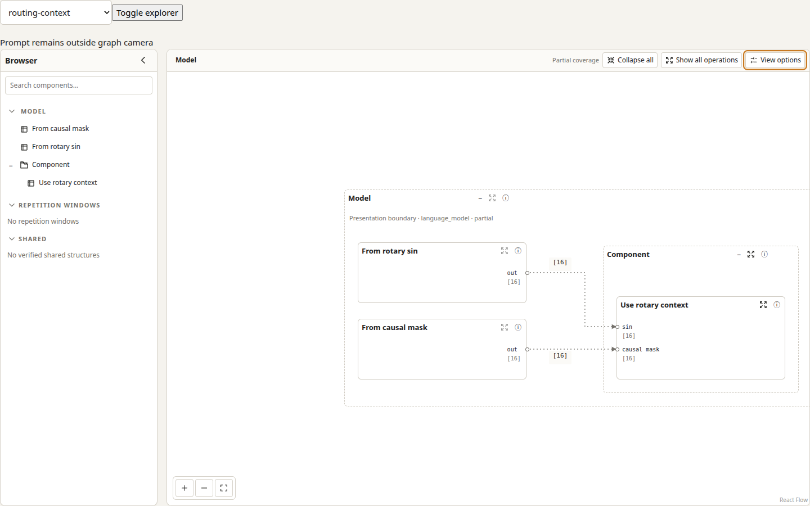

# Boundary routing evidence

The compact independent fixtures use no model files. Baseline is the pinned epic
base `c4b369305aaaff1a7019872b577a3a32ca6a93a2`; the candidate is issue
#215's implementation. Both were measured with Node 24.14.0 and the same UI
dependencies. `routing-compare.test.ts` counts orthogonal bends and route
segments intersecting the displayed port-label rectangle plus its 4-unit
padding. Each row uses the same graph and view options on both revisions.

| Fixture | Visible nodes / routes | Bends before → after | Padded label intersections before → after | Width before → after |
| --- | ---: | ---: | ---: | ---: |
| Reversed rotary context | 5 / 2 | 2 → 2 | 0 → 0 | 560 → 560 |
| Dense converted inputs, 22 declarations | 3 / 23 | 48 → 42 | 36 → 0 | 682 → 798 |
| Hybrid external and internal inputs, 22 declarations | 4 / 44 | 90 → 42 | 51 → 0 | 809 → 1001 |

The larger existing exhaustive fixture contains 479 visible nodes, 655 routes
and 1,088 ports. Three `layoutGraph` calls in each checkout took 869/593/538 ms
on the base and 879/602/584 ms on the candidate (cold run first; warm median
593 → 602 ms). Width changed 97,018 → 101,502 layout units; height remained
2,403. This is measured evidence for this fixture, not a general performance
limit. The bounded worker remains at its existing 10-second timeout.

The browser screenshot shows the two independently authored context signals in
Model view with Show dimensions enabled. The Playwright case checks exact label
hover sets and verifies that hover leaves the camera and layout count unchanged.

Reproduce the compact unit geometry and measurement on this branch with
`cd ui && npm test -- --run src/architecture-explorer/routing-clearance.test.ts src/architecture-explorer/routing-compare.test.ts`.
The matching baseline measurements were obtained from a clean archive of the
pinned base with the same compact fixture and measurement logic.
The larger timing run called `layoutGraph(makeProjectionFixture(), { expanded: [], exhaustive: true })`
three times in each checkout; that fixture and scenario are also covered by the
repository's `auto-layout.test.ts`.
Run the browser case with
`cd ui && UI_TEST_PORT=49173 ./node_modules/.bin/playwright test --project=desktop tests/architecture-interfaces.spec.ts --grep 'rotary sin and causal mask'`.
