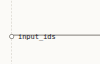
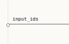

# Boundary port label clearance

Compact crops from the deterministic SmolLM2 production browser fixture at 1440 × 1000, DPR 1. The left crop replays the former centered label position in the browser; the right crop shows the committed raised position. Both use the same graph, route, viewport and cable. The browser check also captures full view and emphasis screenshots as uncommitted Playwright artifacts.

| Former centered position | Raised position |
| --- | --- |
|  |  |

Reproduce with `cd ui && npm run build && xvfb-run -a -s '-screen 0 1440x1000x24 -nolisten tcp -extension GLX' npx playwright test --config acceptance/playwright.config.ts --grep 'port labels keep cable clearance'`. The check covers DPR 1 and 2, Show dimensions, a constrained width, and an isolated nonzero layer. It compares rendered bounds with the layout's label rectangle and label hover with terminal hover, then asserts no change to the layout count, camera, graph requests or numeric texture count during emphasis.
