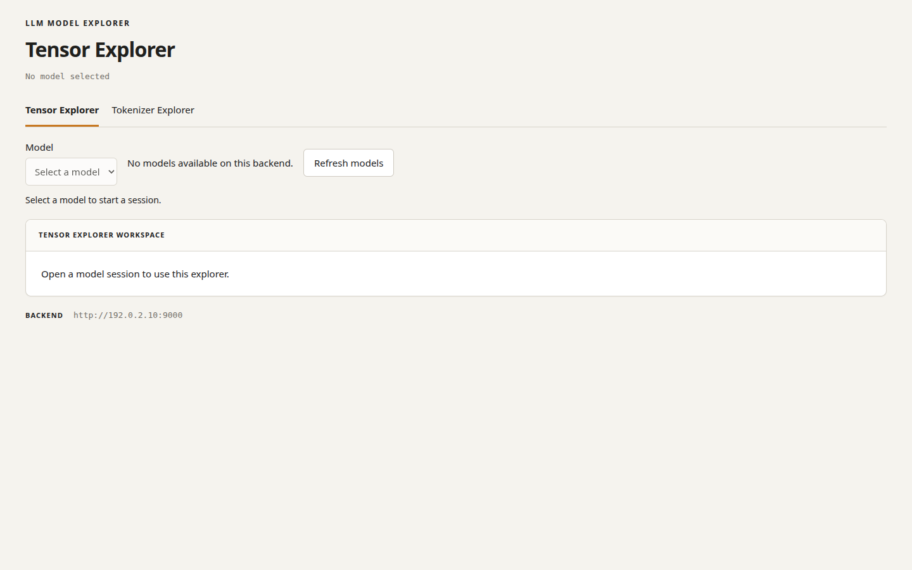
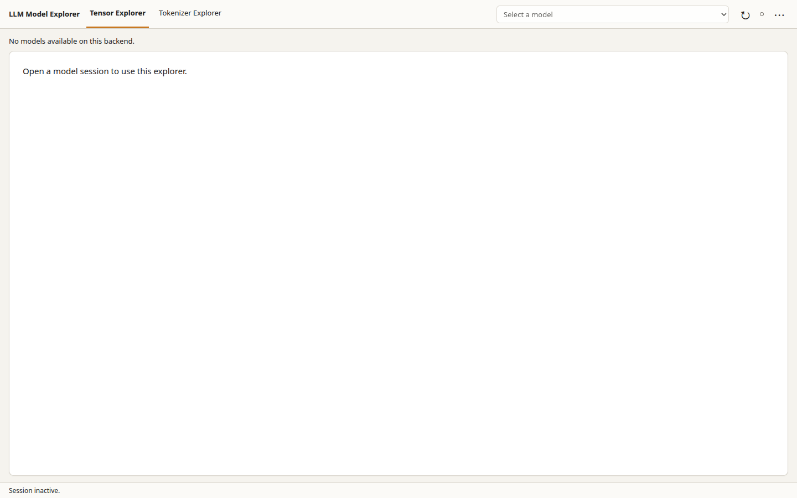

# Compact application shell evidence

The geometry assertions in `ui/tests/shell-viewport.spec.ts` are the acceptance
gate. They check loading, active Tensor/Tokenizer workspaces, closed sessions,
empty catalogues, failed refreshes, and open session options. Controls remain
inside the viewport, and both the document and body have zero overflow.

| Viewport (CSS px) | Top bar | Workspace frame | Status bar | Workspace share |
| --- | ---: | ---: | ---: | ---: |
| 1440 × 900 | 52 | 820 | 28 | 91.1% |
| 1000 × 840 | 52 | 760 | 28 | 90.5% |
| 390 × 640 | 52 | 560 | 28 | 87.5% |
| 280 × 400 | 52 | 320 | 28 | 80.0% |

The workspace frame includes its padding and any transient notices; these
percentages do not claim that every workspace pixel displays scientific data.
Inventory and working panels scroll within that frame. Keyboard checks cover
navigation, visible selector focus, refresh, session options, Escape dismissal,
and session deletion through the existing typed API.

The screenshots below are secondary evidence from the same empty-catalogue
fixture at 1440 × 900, captured by the desktop production-build shell test.
The baseline is `a65025c0004fca179b874efe8a2353e91ae31f57`.

| Before | After |
| --- | --- |
|  |  |

Reproduce with the locked dependencies and Chromium installed:

```sh
cd ui
npm run check
xvfb-run -a npm run test:browser
npm run test:acceptance
```

Run the browser suites sequentially: their default artifact directories overlap.
Product acceptance requires the locked backend environment in `backend/.venv`.
The optional local-reference-model cases require `LMEX_REFERENCE_MODEL_DIR`;
they are skipped when that model is not supplied.
