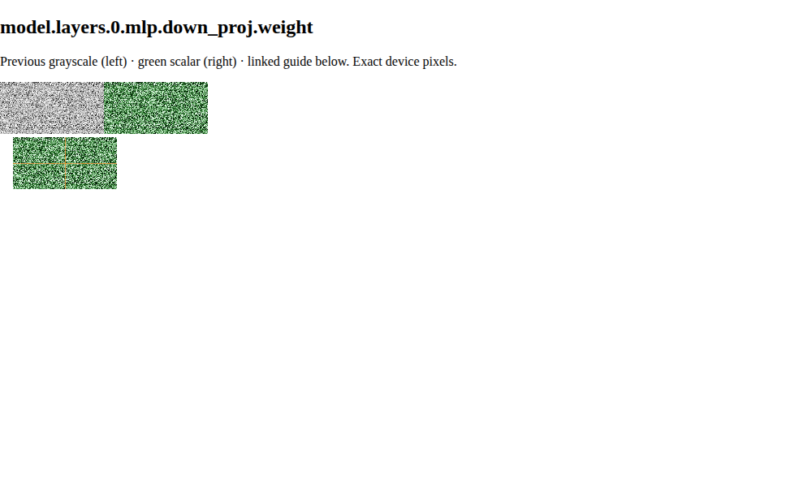

# Green scalar display and linked inspection

Issue #40 changes display transfer and inspection compositing only. Tensor float32
and distribution uint32 storage, backend statistics/binning, stream protocols and
one-value-to-one-device-pixel geometry remain unchanged. The owning normative
rules are in `docs/spec/ui/rendering.md` and `tensor-explorer.md`.

The p01/p99 sigmoid default slope is 12 (previously 8). Its output feeds a
monotonic linear-sRGB green curve with a darker midrange and pale endpoint.
One-device-pixel amber guides use 0.65 opacity; the intersection uses 0.9.
Compositing changes final display luminance, while preserving the underlying
scalar transfer. Clearing inspection restores the original pixel bytes exactly.
Pending and nonfinite colors remain explicit, and pending coordinates do not
activate linked guides.

## Deterministic checks

`npm run check` in `ui/` covers generated API bindings, TypeScript, ESLint, unit
checks and the production build. `xvfb-run -a npm run test:browser` covers desktop,
narrow and native-scrollbar cases. Renderer pixel oracles are independent of the
production helpers and allow at most one display code of error per channel.

`renderer.spec.ts` checks green luminance ordering, endpoint guide salience,
constant/fallback/extreme/nonfinite/pending states, exact readout and resource
invariants. Tightly centered and outlier-heavy samples retain all 51 distinct
central-half levels, exceed the previous central display separation by at least
20%, and keep p25-to-p75 decoded luminance separation above 0.5. Tail compression
is intentional; exact values remain readable even when adjacent tail levels
quantize to the same display code.

`matrix-inspection.spec.ts` checks every pixel in all three surfaces for first,
last and interior selections, across texture bands and native scrolling at DPR
1 and 2. Only the exact selected row/column gets an amber guide, including zero
count bins. All 81 magnifier source pixels and their nearest-neighbor enlargement
match the matrix. Repeated hover preserves texture creation/storage/upload counts,
CPU allocations, network requests, geometry and scroll. Keyboard focus retains
exact text and uses the same coordinate propagation.

The production acceptance checks exercise the real TCP backend, progressive
rendering, linked scrolling, magnifier, exact values, cancellation and cleanup.

## Local SmolLM2-135M Base smoke

The operator's existing local `HuggingFaceTB/SmolLM2-135M` Base safetensors were
read with `safetensors.safe_open(framework='pt')`. Full-tensor finite p01/p99
statistics were computed with NumPy's linear quantiles; the first 64 rows × 128
columns of each tensor were rendered at exact device pixels with those anchors.
No model download, weight mutation, or committed weight sample was needed.

| Tensor | p01 / p99 | Previous p40–p60 display spread | New p40–p60 display spread | Sample luminance p10 / p90 |
| --- | --- | --- | --- | --- |
| layer 0 MLP down projection | -0.498046875 / 0.5 | 29 | 53 | 0.014 / 0.849 |
| layer 0 MLP up projection | -0.443359375 / 0.443359375 | 37 | 67 | 0.009 / 0.888 |
| token embeddings | -0.380859375 / 0.3203125 | 25 | 44 | 0.059 / 0.851 |

Display spread measures 8-bit green-channel separation at the full tensor's p40
and p60 values (the previous neutral transfer has equal RGB channels). It measures
tonal separation, not a perceptual color-distance score. All 24,576 sample pixels
matched an independent double-precision palette oracle with zero channel error,
stayed in the green family and retained exact float32 readout. Guide redraws
changed neither allocation nor upload counts.

The captured comparison shows the down projection's previous grayscale transfer,
new green transfer, and active guides. Each displayed sample remains 128 × 64
device pixels; the comparison is an inspection sample, not a replacement for
opening the complete tensor in the product.

Local renderer/browser evidence uses Chromium SwiftShader and does not establish
hardware-GPU behavior. Sandboxed Xvfb could not allocate WebGL2 resources; host
Xvfb runs exercise the repository's native-scrollbar configuration.
