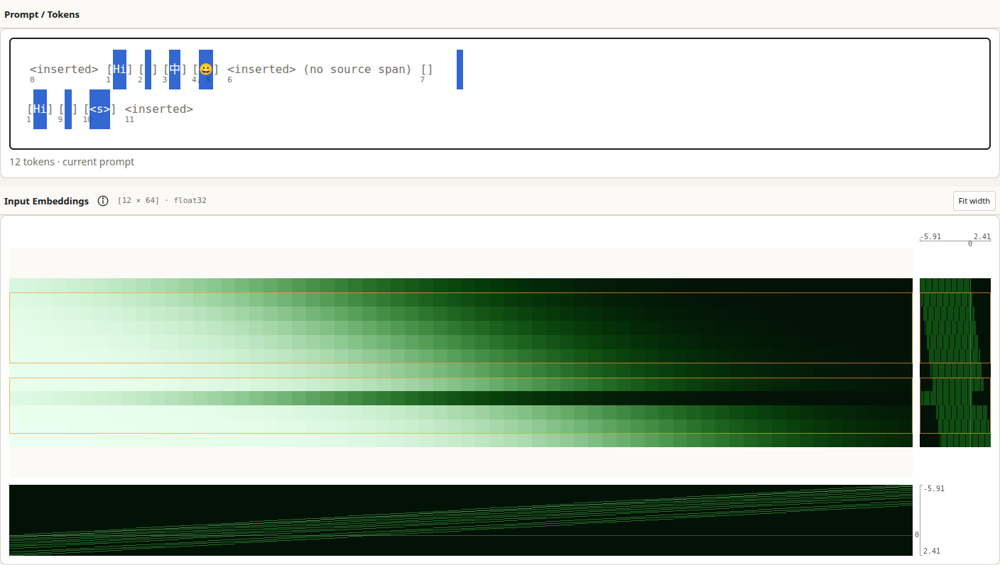

# Persistent source selection

The browser fixture selects the native source `Hi 中😀\nHi <s>` with Select All.
The two outlined row bands are `[1, 6)` and `[7, 11)`, projected into the right
row distributions. Positions 0, 6 and 11 are unmapped and remain outside the
bands. The repeated `Hi` ID retains its distinct sequence position; both
byte-level emoji spans are included. The source-typed `<s>` participates normally.

The screenshot uses deterministic CPU-authored API fixtures and real Chromium
WebGL2 (SwiftShader), not a downloaded checkpoint. The embedding values and
analysis come through the production typed client and binary stream consumer.

The focused browser assertions cover pointer and keyboard selections in both
directions, partial tokens, caret clearing, focus/hover persistence, offscreen
rows, exact visible matrix/profile bounds, underfill, manual navigation, resize
and DPR changes. They compare camera geometry, history activity, native scroll,
panel allocation, operation counts, renderer allocations/uploads, scalar/count
samples, transfer updates and bin-domain labels across source-selection changes.
The same-shaped replacement test changes reliable source spans and requires a
new row mapping only after the matching staged matrix is promoted. Cancellation,
failed tokenization, session/options changes, edits and late responses are fenced.

Unit tests independently cover strict offset intersection (including multiple
ranges, surrogate halves and transitively overlapping annotations), invalid row
positions, and controlled Matrix Explorer updates without subscription or camera
side effects. Existing editor and matrix suites retain clipboard, undo/redo, IME,
exact inspection, region/range zoom and history regression coverage.

Validation uses the pinned Node 24.14.0 / npm 11.9.0 toolchain. Executed check
results are recorded in the implementation PR. This fixture evidence makes no
claim about full local reference-model acceptance or GPU-specific rendering.
